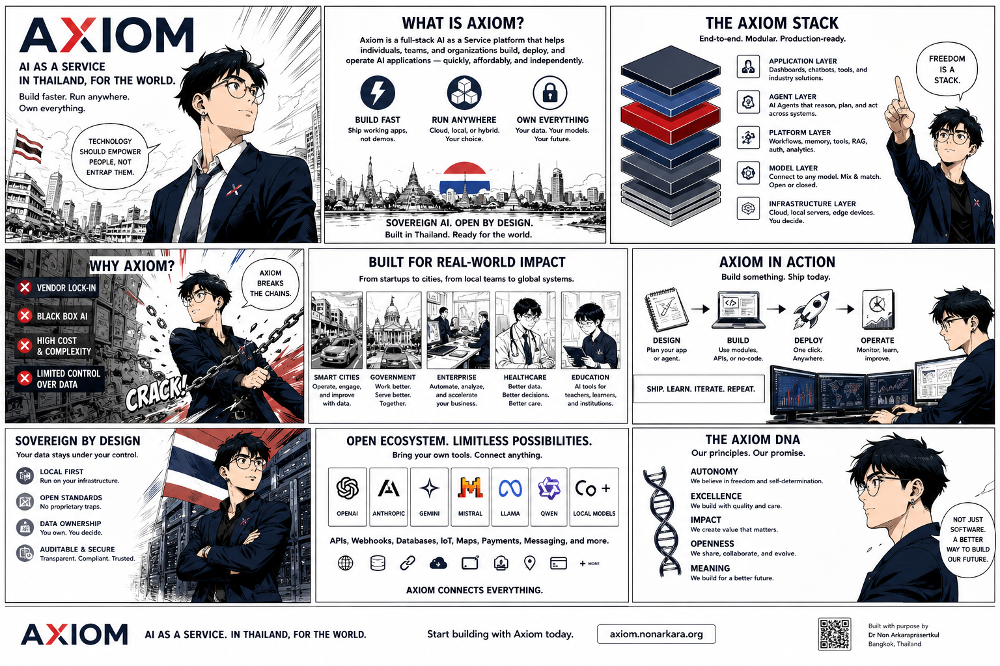
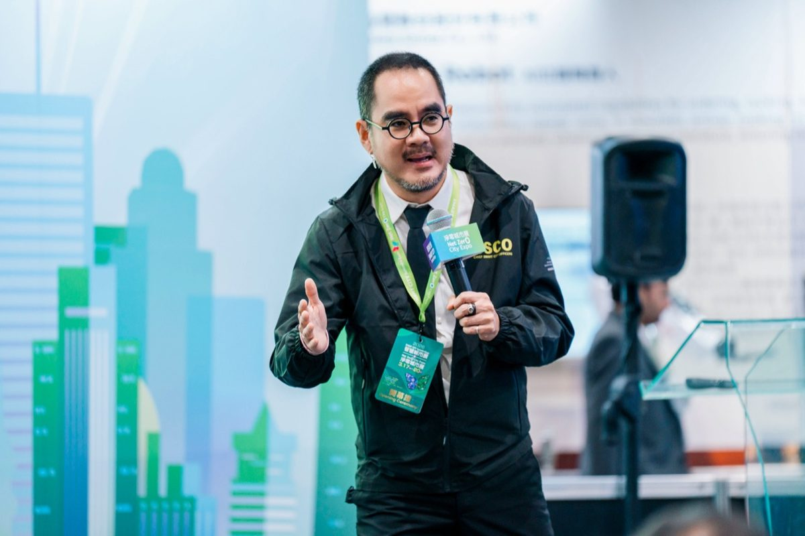
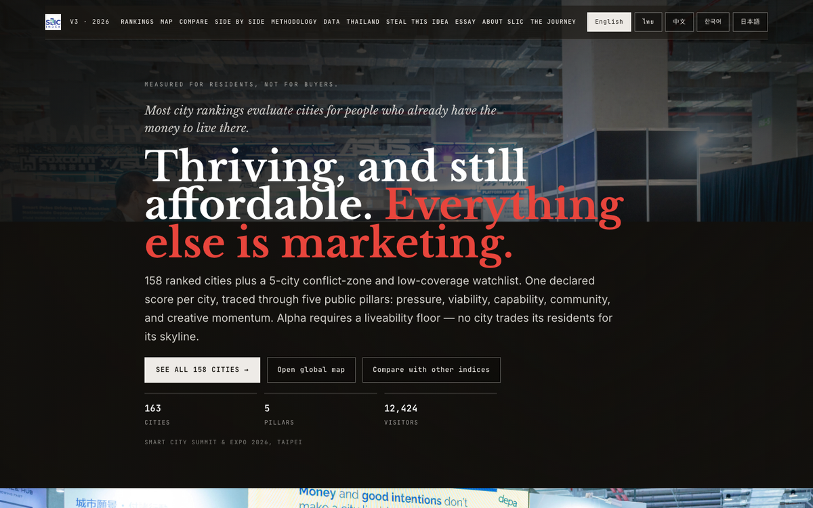
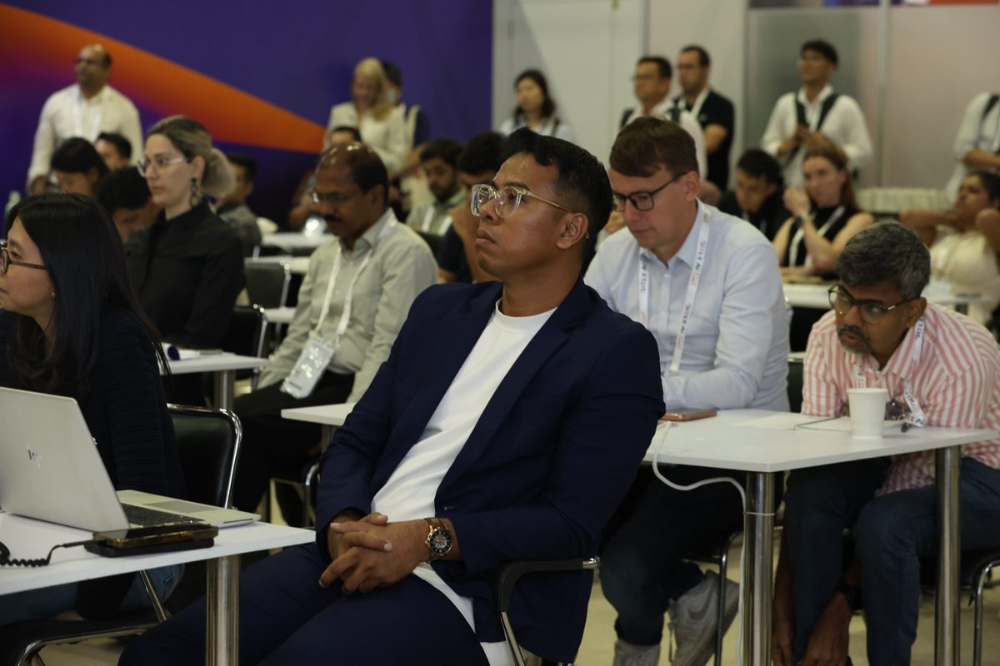
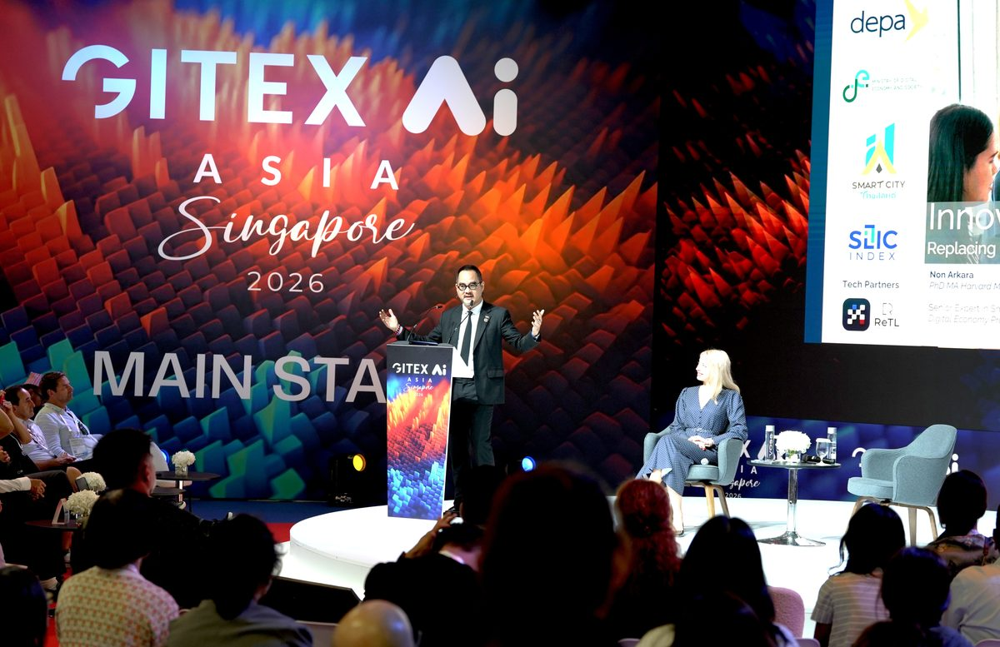

# Axiom

**Decision systems for cities, governments, and operators.**

[axiom.nonarkara.org](https://axiom.nonarkara.org) · Bangkok · Legal entity: Axiom X Co., Ltd. · Reg. 0105569099335

> Most "smart city" work ends as a deck. Ours runs in production.  
> Problem mapped in week one. Something working before any presentation.  
> Every decision tracked from the start.



---

## The Thesis

Governments don't have a technology problem. They have a speed problem.

The standard public-sector cycle — requirements gathering, committee review, vendor RFP, six-month implementation, delayed deployment — takes 18 to 36 months before anything works. Cities fall behind. Problems compound. The slide deck that took three months to approve is obsolete before it ships.

Axiom doesn't pitch systems. We build them, on real data, before any presentation. By the time the meeting happens, the working prototype is already in the room.

Every system on this page started because someone said "too complex" or "too expensive" or "the vendor needs six months." The answer was never to argue. It was to build.

---

## The Site

This repository is the source for `axiom.nonarkara.org` — a live dashboard built in static HTML, vanilla JS, and custom CSS. No framework, no build step. It deploys via GitHub Actions → Cloudflare Pages on every push to `main`.

The site is itself an Axiom product: it demonstrates, by existing, what the methodology produces.

**Stack:** Static HTML · Vanilla JS · Custom CSS (Rams-grade light theme) · Leaflet (live map with auto-tour) · Canvas 2D animation · EN/TH/ZH/KO/JA/VI locale switch  
**Deploy:** GitHub Actions → Cloudflare Pages (axiom.nonarkara.org)  
**Design systems:** [Axiom-Design-Core](https://github.com/Nonarkara/Axiom-Design-Core) · [Rams-NYCTA-Design-Core](https://github.com/Nonarkara/Rams-NYCTA-Design-Core)

---

## Systems Showcase — 22 Systems · 5 Countries

*These aren't demos. They're working systems in a sandbox. Production deployments under client NDAs are larger; what runs here behaves like them, with advanced modules withheld.*

### COMMAND — Operations rooms for governors & operators

| System | Country | Description |
|---|---|---|
| **Phuket Ops** | Thailand | Regional operations room — transit, environment, incidents, real-time feeds |
| **HCMCx Super Dashboard** | Vietnam | Metropolitan operations for Ho Chi Minh City |
| **Kuching IOC** | Malaysia | Intelligent Operations Centre for Greater Kuching — built for the state |
| **Chula Control Tower** | Thailand | Campus intelligence for Chulalongkorn University |
| **Chonburi Control Tower** | Thailand | Coastal city intelligence — Chonburi province |
| **KMITL Control Tower** | Thailand | Campus intelligence for King Mongkut's Institute of Technology Ladkrabang |
| **Yala Control Tower** | Thailand | Civic intelligence for Yala — deep south operations |

### INTELLIGENCE — Signal & analysis for strategists

| System | Description |
|---|---|
| **DNGWS Monitor** | Strategic intelligence dashboard — geopolitical signal monitoring |
| **SLIC Index** | City benchmarking — 157 cities, 5 pillars, AMPI scoring |
| **Global Monitor** | Strategic intelligence — conflict, politics, markets in one view |
| **Middle East Monitor** | Live conflict signal across the region — open intelligence |
| **DayTraders** | Market intelligence — financial signals for active traders |
| **City Hub** | Urban intelligence aggregator — city data in one surface |

### CIVIC — National platforms & citizen infrastructure

| System | Description |
|---|---|
| **Smart City Thailand Index (SCITI)** | National programme — 174 Thai cities ranked on smart city dimensions |
| **Phuket Smart Bus** | Transit intelligence — real-time rider-facing bus system |
| **SCTH City Data Platform** | Civic intelligence for Thailand's smart city ecosystem |
| **NSP** | National broadcast — digital content platform |
| **Ekkasarn AI** | Document intelligence — AI-powered Thai government document processing |

### EMERGING — Research-grade / preview access

| System | Description |
|---|---|
| **Dr Non's AI Council** | Agentic intelligence — 11 AI justices with different priors, deliberating on hard questions |
| **TKCX** | Talent intelligence — game archetypes, readiness scores, Moneyball salary cap for teams |
| **Second Brain OS** | Knowledge intelligence — personal AI operating system, MCP-connected |
| **Horizon 45** | Capability lab — experimental AI and systems research |
| **Dao De Jing** | Digital humanities — classical philosophy made navigable |
| **Ikigai Finance Engine** | Finance intelligence — purpose-to-portfolio alignment system |

---

## Key Moments

### Smart City Summit & Expo — Taipei, 2026

City Vision Stage. SLIC Index launched live from the stage — the first time a ranking system for 157 cities went live in front of the people building those cities. The reaction in the room told us the thesis was correct: mayors don't want a presentation about what smart cities could look like. They want to see where their city ranks, right now, against their peers.





### GITEX AI Asia — Marina Bay Sands, Singapore, April 2026

Main-stage keynote. Then a workshop on Government Innovation as a Service that hit capacity within minutes — standing room taken, hallway full, every face locked on the live demo.

> "The room was standing-room only. That is not applause — that is a demand signal. Governments want working systems. They are tired of waiting for the deck."  
> — Dr. Non, post-keynote

| | |
|---|---|
| Main stage audience | 1,000+ |
| Total event attendees | 23,000+ |
| Nations represented | 110+ |
| Workshop status | Full · standing room only |





---

## Field Notes — Things Learned by Actually Shipping

Twenty systems. Two people. Twelve months. These are the patterns that held — and the ones that didn't. Published because the gap between what governments need and what the market supplies only closes if people share what they've figured out.

**01 — The vendor said no. We shipped in fourteen days.**

Every system on this page started because a procurement cycle, a vendor quote, or a committee said the problem was too complex or too expensive. The answer was never to argue — it was to build a rough working version and put it in the room. A live surface changes the conversation faster than any proposal.

**02 — AI-native is not AI-assisted.**

Every line of code across these systems was written by Claude Code, directed by Dr Non. The AI is the engineer. The human is the architect. This isn't a shortcut — it's a different model of who does what. Knowing how to direct AI precisely is the skill that compounds. The code is not the hard part.

**03 — The problem is never the data. It's always the decision behind the data.**

Clients ask for dashboards. What they need is clarity on one decision that must get faster or better. Find that decision first. Everything else — the feeds, the stack, the interface — flows from it. Skip this step and you build a beautiful dashboard nobody checks after the launch week.

**04 — An org chart tells you who reports to whom. It tells you nothing about who should build what with whom.**

TKCX was built on this gap. Game archetypes, readiness scores, and a Moneyball salary cap exposed what the org chart hid: the right people for a given project, the chemistry between them, and the skill gaps that will surface midway through. Treat talent like a portfolio, not a headcount.

**05 — A single AI answers. A council deliberates.**

For decisions that matter, a single model gives you one framing — the one baked into its training. The AI Council runs eleven justices with different priors, explicit moves, and a shared transcript everyone reads before speaking. The disagreement is the product. You leave with a more defensible position than you started with.

**06 — Instrument from day one. Not after.**

Every Axiom system ships with a data trail: pageviews, usage signals, decision logs. Not because we need the analytics on day one — but because retrofitting measurement onto a live system is nearly impossible, and the next version is always built from what the first version taught you. Leave a record.

---

## The Founders


Two founders. No handlers. You talk to the people who write the code and decide the architecture. When the work needs UAV operators or traffic engineers or policy translators, we pull them in for that mission only — never as a standing bench.

### Dr. Non Arkaraprasertkul — Co-Founder · Systems & Story

Anthropologist, architect, builder. He watches how cities actually behave, then turns that mess into interfaces people use without a training manual.

Harvard PhD in Anthropology. MIT and Oxford alumnus. Former Visiting Lecturer at MIT, postdoctoral fellow at NYU, Expert-In-Residence at IDEO Shanghai. He designs from fieldwork first — because people aren't spreadsheets and cities aren't slides.

**Education**
- PhD in Anthropology — Harvard University, 2016
- MA in Anthropology — Harvard University, 2015
- MPhil in Modern Chinese Studies — University of Oxford, 2010
- MSc in Architecture Studies + Urban Design Certificate — MIT, 2007
- BArch, First Class Honors / Summa Cum Laude — KMITL, 2004

**Current Role**  
Senior Expert in Smart City Promotion, Digital Economy Promotion Agency (depa), Bangkok — May 2019–present. Advisor to Thailand Media Fund, SLIC, NXPO, and the National Strategic Taskforce on Northern Economic Corridor (NeEC).

**Selected Roles**
- Visiting Lecturer — MIT, Architecture and Urban Design
- Global Postdoctoral Fellow — New York University Shanghai
- Expert-In-Residence (Urban Anthropology) — IDEO Shanghai
- Honorary Senior Lecturer — University of Sydney
- Rectorial Visiting Professor — Jagiellonian University, Kraków

**Scale**
- 120+ technology and public-private projects across 77 Thai provinces
- 5,000+ government officials trained in digital literacy and smart city
- 300+ keynote appearances at global and domestic forums
- 50+ publications in Urban Studies, Journal of Urban Design, and others

**Awards**
- Tomorrow City China Leaders' Award, 2025
- ASOCIO Best Project (DX) Award, 2024
- Smart City Expo World Congress — Global Leadership Award, 2024
- Taiwan Presidential Hackathon — Excellent Team, International Track, 2023
- Expo 2020 Dubai Future Water Hack — First Prize, 2022

[ResearchGate →](https://www.researchgate.net/profile/Non-Arkaraprasertkul)

---

### Dr. Poon Thiengburanathum — Co-Founder · Infrastructure & Delivery

Engineer, strategist, operational anchor. He keeps ambition tied to working systems and makes sure the product survives contact with reality.

Associate Professor at Chiang Mai University. Co-author of Chiang Mai's Smart City Master Plan. Works on cities as complex adaptive systems — real-time bus prediction, transit decision support, sustainable infrastructure.

**Education**
- B.Eng. in Civil Engineering — Chiang Mai University, 1995
- M.S. in Construction Management — University of Colorado at Boulder, 1997
- Ph.D. in Construction Management — University of Colorado at Boulder, 2003
- M.S. in Transportation Engineering — University of Colorado at Denver, 2003

**Current Roles**  
Deputy Director, Program Management Unit for Area-Based Development (PMU-A), Ministry of Higher Education, Science, Research and Innovation, Thailand. Director, Excellence Center for Urban Study and Public Policy (ECUP), Chiang Mai University.

**Selected Work**
- Head of Sustainable Infrastructure Development and Climate Change Research Unit, CMU, 2010–present
- Lead Coordinator, Research University Network (RUN) for Climate Change and Disaster Management, 2015–present
- Bus rapid transit and mass transportation studies in Chiang Mai
- Integrated land-use, logistics, and transport management with World Bank
- Disaster management for critical infrastructure and supply chains

[ResearchGate →](https://www.researchgate.net/profile/Poon-Thiengburanathum)

---

## The Collective

Researchers, traffic engineers, anthropologists, financiers, policy translators, and media operators. They join by problem, not by org chart. We pay for the brains we need, when we need them.

Traffic engineers · UAV operators · Economists · Financiers · Policy translators · Urban researchers · Media operators

---

## Pro Bono — Institutional Work

These are live, working platforms — not decks or reports.

| Work | For | Description |
|---|---|---|
| [ASEAN Smart Cities Network](https://ascn.depa.or.th) | ASEAN Secretariat | 38 cities, 10 nations, one platform |
| [ASEAN CSCO Handbook](https://asean.nonarkara.org/#manifesto) | ASEAN · UNDP · UN-Habitat | 112,000 users. Born from real flooding in Southeast Asia |
| [Solomon Islands Digital Roadmap](https://solomon.nonarkara.org/#institutions) | UN DESA · Solomon Islands Government | Whole-of-government digital roadmap. Honiara, two-day workshop |
| [Smart City Leadership](https://scl.nonarkara.org/) | depa Thailand | Thailand's digital promotion agency, online. Bilingual |

---

## The Design System

Two public repositories document how Axiom builds things.

### [Axiom-Design-Core](https://github.com/Nonarkara/Axiom-Design-Core)

The complete Axiom design system. MoMA Law × Golden Section × The Divine Move = Axiom. Three modes: Instrument (dashboards, live tools), Editorial (documents, decks), Play (games, workbooks). Full token set, live component gallery, quick-start template.

### [Rams-NYCTA-Design-Core](https://github.com/Nonarkara/Rams-NYCTA-Design-Core)

Dieter Rams's principles combined with the Vignelli/NYCTA wayfinding system. Two masters, one law: nothing appears that does not serve a decision. Token set, disc system, cockpit pattern, decision tree, philosophy in full.

---

## Tech Stack — 109 Tools · 9 Layers

| Layer | Tools |
|---|---|
| **Cloud Infrastructure** | GitHub Pages · Vercel · Cloudflare Pages · Cloudflare Workers · Cloudflare DNS · R2 · Supabase · Render · Railway · Fly.io · Hetzner VPS |
| **Framework & Connectors** | React · Next.js · Node.js · Tailwind CSS · Vite · Express · GitHub Actions · Fastify |
| **Platform & Build Tools** | Claude Code ★ · VS Code · GitHub · Cursor · Obsidian · Warp · Wispr Flow |
| **AI Models & Engines** | Claude Opus 4.8 ★ · GPT · Gemini · Grok · DeepSeek · Kimi · GLM · Qwen3-Coder (local) · Gemma 4 · Fable 5 · OpenRouter |
| **Libraries** | Deck.gl ★ · Leaflet · Mapbox GL · MapLibre · D3 · Chart.js · PostGIS · grammY · LINE SDK · pgvector |
| **Languages** | JavaScript · Python ★ · TypeScript · HTML · CSS · SQL · Bash · Go · PHP |
| **Live Data Sources** | NASA FIRMS · NASA GIBS · ACLED · Copernicus Sentinel · GISTDA ★ · World Bank · FRED · Open-Meteo · Bank of Thailand · AISStream · CelesTrak |
| **Channels** | Telegram ★ · LINE · WhatsApp · Slack · Discord · Feishu |
| **Local Runtime** | M5 Max 128GB ★ · M3 MacBook Air · PostgreSQL · Docker Desktop |

★ Primary / favorite. Local-first. No build team. No vendor lock-in. The M5 Max runs inference, builds, and deploys from one desk in Bangkok.

---

## Press

- [With the vendor saying no, Thai civil servant built his own tools](https://govinsider.asia/intl-en/article/with-the-vendor-saying-no-thai-civil-servant-built-his-own-tools) — GovInsider
- [Can Innovation-as-a-Service close the gap between policy and implementation?](https://govinsider.asia/intl-en/article/can-innovation-as-a-service-close-the-gap-between-policy-and-implementation) — GovInsider
- [They built the index, but you build the ranking](https://mayorsofeurope.eu/news/they-built-the-index-but-you-build-the-ranking/) — Mayors of Europe
- [On digital connectivity, open innovation, and why smart cities only work when inclusion scales](https://theaseanmagazine.asean.org/article/non-arkaraprasertkul-phd/) — The ASEAN Magazine
- [How AI is mining city data cheaply and making them smarter](https://www.youtube.com/watch?v=NC11q3zM6x4) — YouTube
- [Why smart cities need citizens, not just technology](https://technode.global/2023/01/18/a-smart-city-cannot-exist-without-its-citizens-and-technological-advances-will-foster-stronger-trust-between-citizens-and-institutions-and-encourage-civic-participation-says-dr-non-arkaraprasertkul/) — TechNode Global

---

## Credentials

**Trade name:** Axiom  
**Legal entity:** Axiom X Co., Ltd. (บริษัท แอคเซี่ยม เอ็กซ์ จำกัด)  
**Registration:** 0105569099335 · Department of Business Development (DBD) · Thailand  
**Certificate:** [public/axiom-company-registration-certificate.pdf](public/axiom-company-registration-certificate.pdf)

---

## Repository Structure

```
public/
├── index.html              # Main site — all content in one file
├── app.js                  # i18n strings (EN/TH/ZH/KO/JA/VI) + all section content
├── rams.css                # Primary stylesheet — Rams-grade design system
├── theme-masterpiece.css   # Master theme (border-radius:0, amber palette)
├── i18n-regional.js        # Regional locale extensions
├── assets/                 # Logos, OG image
├── corporate identity/     # 8 Axiom brand guideline sheets
├── images/                 # Press, event, and team photography
├── photos/                 # Pro bono and additional photography
├── screenshots/            # System screenshots for showcase panels
└── showcase/               # System panel detail content
```

---

## Anti-Regression Note

This site has a documented history (`CLAUDE.md`) of being silently overwritten by AI coding assistants defaulting to generic templates. Several elements are permanent and must never be removed or "simplified":

- The Leaflet map with AUTO TOUR loop
- The satellite HUD with coordinate overlays
- The Canvas 2D background animation
- The rotating headline carousel
- The `[EVENT_ID]` protocol sections (SCSE_2026_TPE / GITEX_ASIA_2026_SGP)
- The mono-amber palette — `border-radius: 0 !important`, zero gradients, zero pastels
- The `data-theme="masterpiece"` attribute on `<html>`

Last known-good rich version: commit `ee756b7`. Recovery: `git show ee756b7:public/index.html`

---

## Contact

[axiom.nonarkara.org](https://axiom.nonarkara.org) · [LinkedIn](https://www.linkedin.com/company/axiomthailand/)

*Axiom X Co., Ltd. · Bangkok, Thailand*

---

## License

This project is licensed under the MIT License. See [LICENSE](LICENSE).
